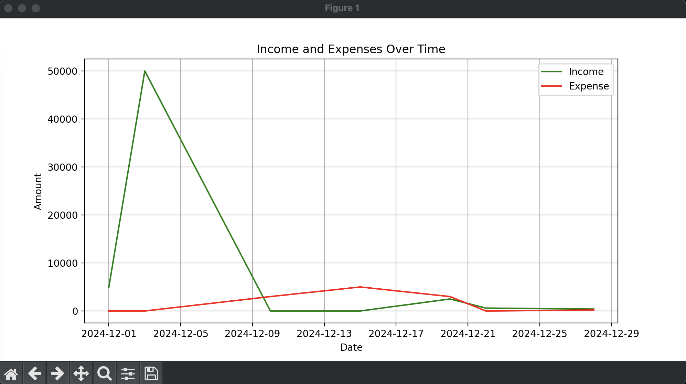

# Personal Finance Tracker App

A simple Python-based application to help you track your income and expenses, providing insightful visual graphs to better manage your finances.

## Features

- **Track Income & Expenses**: Easily input your daily income and expenses.
- **Data Visualization**: View your financial data through interactive graphs for clear insights.
- **User-friendly Interface**: Simple command-line interface for quick and easy access to your financial records.
- **Export Data**: Save your financial records in CSV format for further analysis or record-keeping.

## Demo & Visualization

### Application Demo
Click on the link below to watch the demonstration of the Finance Tracker App:

[▶️ Watch Demo Video](https://drive.google.com/file/d/1-7rk9Fm8nxWk_Nr0i0OYuyqvC8IaPalX/view?usp=sharing)

### Financial Insights Graph
Sample visualization of income and expenses:



## Requirements

Before you begin, ensure you have the following:

- Python 3.x installed
- Required libraries (which can be installed via `requirements.txt`):
  - `matplotlib` - for generating visual graphs
  - `pandas` - for handling data and storage

## Installation

### 1. Clone the repository:

```bash
git clone https://github.com/chetanmenaria00/finance-tracker-app.git
cd finance-tracker
```

### 2. Istall the dependencies:

```bash
pip install -r requirements.txt
```

### 3. Start the project:

```bash
python main.py
```